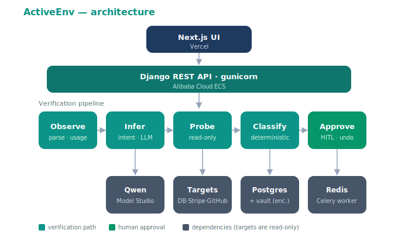

# ActiveEnv

**The agent that catches the config value that is present, valid, authenticating — and still silently wrong.**

ActiveEnv is an Autopilot agent built for the **Alibaba Cloud / Qwen Global AI Hackathon (Track 4 — Autopilot Agent)**. It infers what each config value is *supposed* to be by reading how it is used in your codebase, then **actively probes the real system** (read-only) to see what it *actually* does — flagging mismatches with evidence, and (after human approval) applying a fix and re-probing until reality matches intent.

It is **not** a `.env` linter. A linter checks format and presence. ActiveEnv checks **truth**.

---

## The closed loop

```
infer intent → probe reality → classify → [human approves] → apply fix → re-probe → green
```

## Architecture



A Next.js UI (Vercel) calls the Django REST API on Alibaba Cloud ECS, which runs the five-stage verification pipeline. **Observe** parses the config and locates each key's usage in the code; **Infer** asks Qwen what the value *should* be for the target environment; **Probe** runs a read-only check against the real target; **Classify** deterministically decides `correct` / `suspect` / `silently_wrong`; **Approve** is the human-in-the-loop gate that applies a fix and re-probes. Postgres holds runs, findings, the audit log and an encrypted secret vault; Redis + a Celery worker handle async re-probing.

## Probe adapters (each provably reliable, all read-only)

| Adapter | Catches | How |
|---|---|---|
| **Postgres** | staging DB used in prod | `SELECT current_database(), inet_server_addr(), version()` |
| **Stripe** | test key in prod (or live in test) | `sk_test_`/`sk_live_` + API `livemode` flag |
| **GitHub** | wrong account / org / scope | `GET /user`, `/repos` identity & scope |

**Simulation mode** (`SIMULATE_PROBES=true`, the default) derives the same evidence from the self-describing parts of a value — a `sk_test_` prefix *is* test mode, a URL host *is* the connect host — so the full reveal runs with **zero external credentials**. Set it `false` to probe the submitted targets for real.

## Tech stack

- **Frontend:** Next.js (React) + Tailwind — the live demo surface
- **Backend:** Django REST Framework + Celery + Redis
- **LLM:** Qwen via Alibaba Cloud Model Studio (OpenAI-compatible, function calling)
- **Agent ↔ tools:** read-only probe adapters (`backend/probes/`), also exposed over MCP
- **Datastore:** Postgres (runs, findings, audit log, encrypted vault)
- **Deploy:** Alibaba Cloud ECS + Docker Compose; frontend on Vercel

## Repository layout

```
backend/    Django REST API, verification pipeline, Qwen client, probes/, tests
frontend/   Next.js demo surface (run screen, findings board, green loop)
docs/       architecture diagram, deploy runbook, security/compliance notes
```

## Quick start (local dev)

```bash
# 1. Copy env template (DASHSCOPE_API_KEY optional — simulation mode needs no keys)
cp .env.example .env

# 2. Start Postgres + Redis
docker compose up -d

# 3. Backend
cd backend && python -m venv .venv && source .venv/Scripts/activate
pip install -r requirements.txt
python manage.py migrate && python manage.py runserver

# 4. Frontend (separate terminal)
cd frontend && npm install && npm run dev
```

Open http://localhost:3000, click **load example**, and hit **Run** to watch a
config with two silently-wrong values get caught, fixed, and turned green.

> The frontend reads `NEXT_PUBLIC_API_BASE_URL` (defaults to `http://localhost:8000`).

## Deploy

Production runs the whole backend stack with one command:

```bash
docker compose -f docker-compose.prod.yml --env-file .env up -d --build
```

Full step-by-step (ECS provisioning, security group, Vercel, go-live checklist)
is in **[docs/DEPLOY.md](docs/DEPLOY.md)**.

## Safety model (non-negotiable)

- Probes are **strictly read-only** — connect / authenticate / GET only. Never write.
- Secrets masked everywhere (UI, logs, audit) and **encrypted at rest** (Fernet). Never plaintext.
- Fixes require **explicit human approval** before being applied; re-probe after to confirm.
- Full audit trail with **undo** on every action.

Details and the threat model are in **[docs/SECURITY.md](docs/SECURITY.md)**.

## License

[MIT](LICENSE) © 2026 Suman Mishra
